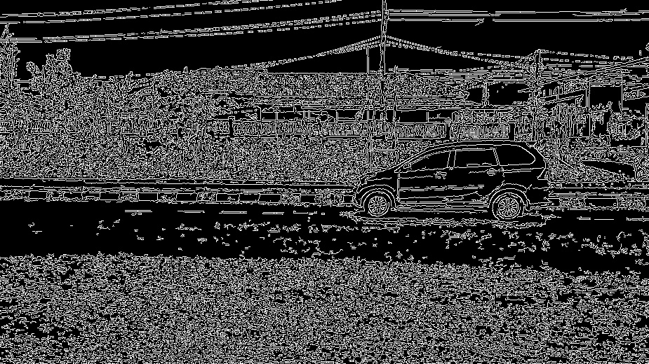

# 🖼️ Proyek Deteksi Tepi & Pencocokan Template (Edge Detection & Template Matching)

Proyek ini berisi kumpulan skrip Python untuk mendemonstrasikan berbagai teknik pemrosesan gambar (Image Processing) fundamental menggunakan OpenCV.


*Contoh hasil deteksi tepi menggunakan metode Canny.*

---

## ✨ Teknik yang Diimplementasikan

1.  **Adaptive Thresholding (`adapt_thres.py`):**
    - Memisahkan piksel menjadi foreground dan background berdasarkan nilai ambang batas (threshold) yang dihitung secara lokal untuk setiap wilayah gambar. Berguna untuk gambar dengan kondisi pencahayaan yang bervariasi.

2.  **Deteksi Tepi (Edge Detection) (`edge_detect.py`):**
    - **Metode Canny:** Algoritma deteksi tepi multi-tahap yang populer karena akurasinya.
    - **Metode Sobel:** Mendeteksi tepi dengan menghitung gradien intensitas piksel pada gambar.

3.  **Pencocokan Template (Template Matching) (`template_matching.py`):**
    - Mencari lokasi dari sebuah gambar template di dalam gambar yang lebih besar. Skrip ini mendemonstrasikan 6 metode pencocokan yang berbeda yang tersedia di OpenCV.

---

## 💻 Teknologi yang Digunakan

- **Bahasa Pemrograman:** Python
- **Library Pemrosesan Gambar:** OpenCV (`cv2`)
- **Library Plotting:** Matplotlib
- **Library Komputasi Numerik:** NumPy

---

## 📋 Syarat & Instalasi

Pastikan Anda telah menginstal **Python 3.x** dan **pip**.

### Langkah-langkah Instalasi:

1.  **Clone repositori ini (jika ada) atau unduh file-filenya.**

2.  **Install semua dependensi yang dibutuhkan melalui pip:**
    ```sh
    pip install opencv-python matplotlib numpy
    ```

---

## 🚀 Cara Menjalankan

Setiap skrip dapat dijalankan secara individual untuk melihat hasil dari teknik tertentu.

- **Untuk melihat hasil Adaptive Thresholding:**
  ```sh
  python adapt_thres.py
  ```

- **Untuk membandingkan hasil deteksi tepi Canny dan Sobel:**
  ```sh
  python edge_detect.py
  ```

- **Untuk melihat cara kerja berbagai metode Template Matching:**
  ```sh
  python template_matching.py
  ```

> **Catatan:** Pastikan path gambar di dalam setiap skrip sudah benar dan sesuai dengan struktur direktori Anda.
